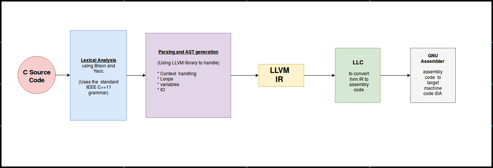

# C-LLVM-compiler

A hobby project for learning to use LLVM. 

It is a simple multipass static C compiler capable of handling loops & contextual semantics that emits LLVM-IR. The only form of IO implemented is "print" function. JIT flavored compilation is supported.

## References :
http://aquamentus.com/tut_lexyacc.html

http://dinosaur.compilertools.net/flex/flex_11.html

https://www.univ-orleans.fr/lifo/Members/Mirian.Halfeld/Cours/TLComp/l3-0708-LexA.pdf

https://www.ibm.com/support/knowledgecenter/en/ssw_aix_72/com.ibm.aix.genprogc/yaac_file_declarations.htm

https://gist.github.com/serge-sans-paille/aa332fa22692fcdfdc51

http://releases.llvm.org/2.6/docs/tutorial/JITTutorial2.html

https://llvm.org/docs/tutorial/LangImpl05.html
